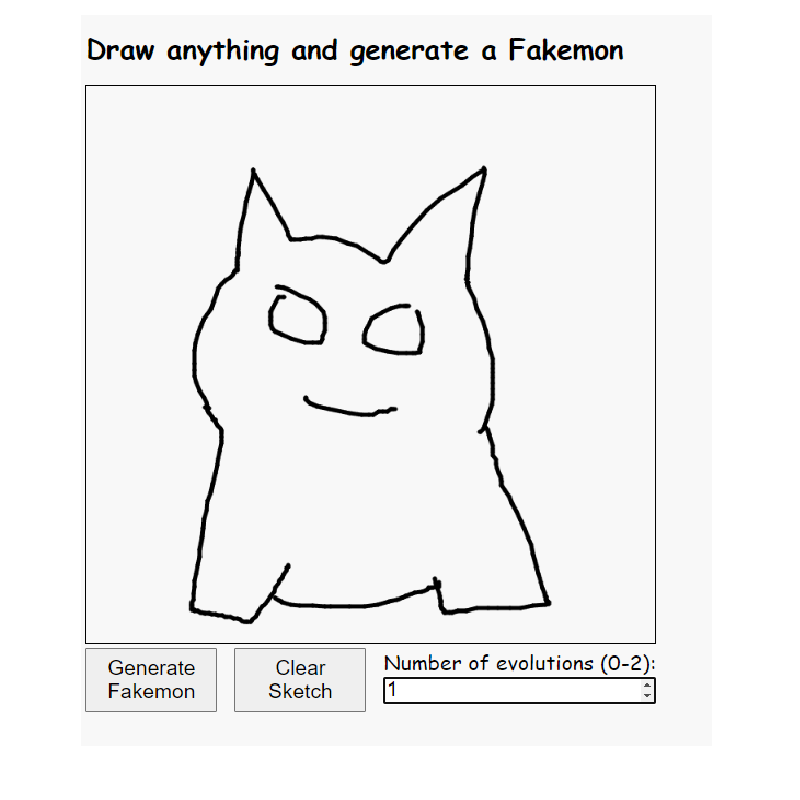
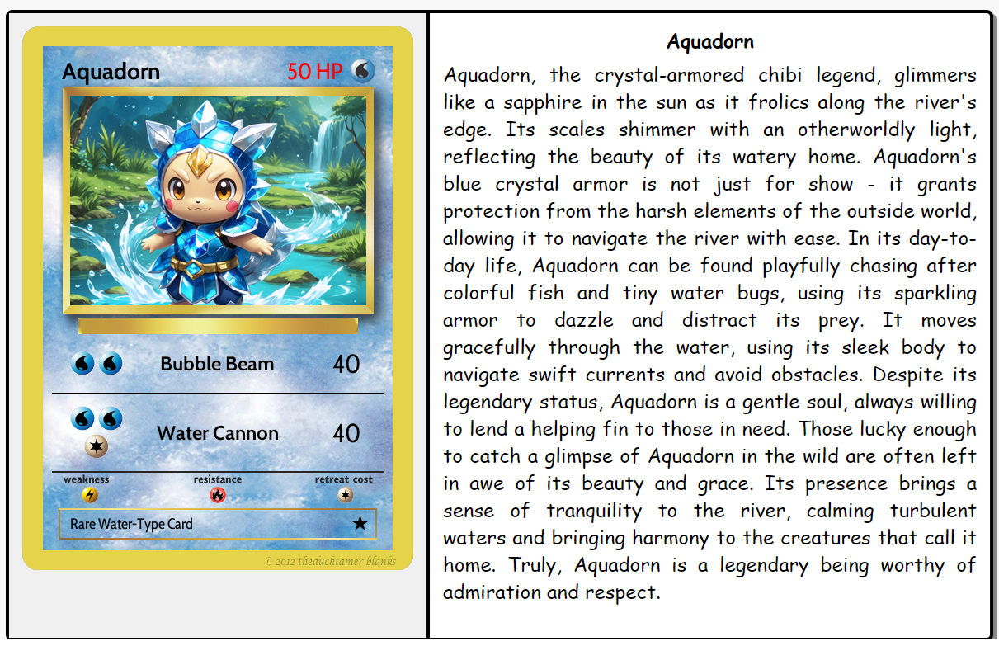
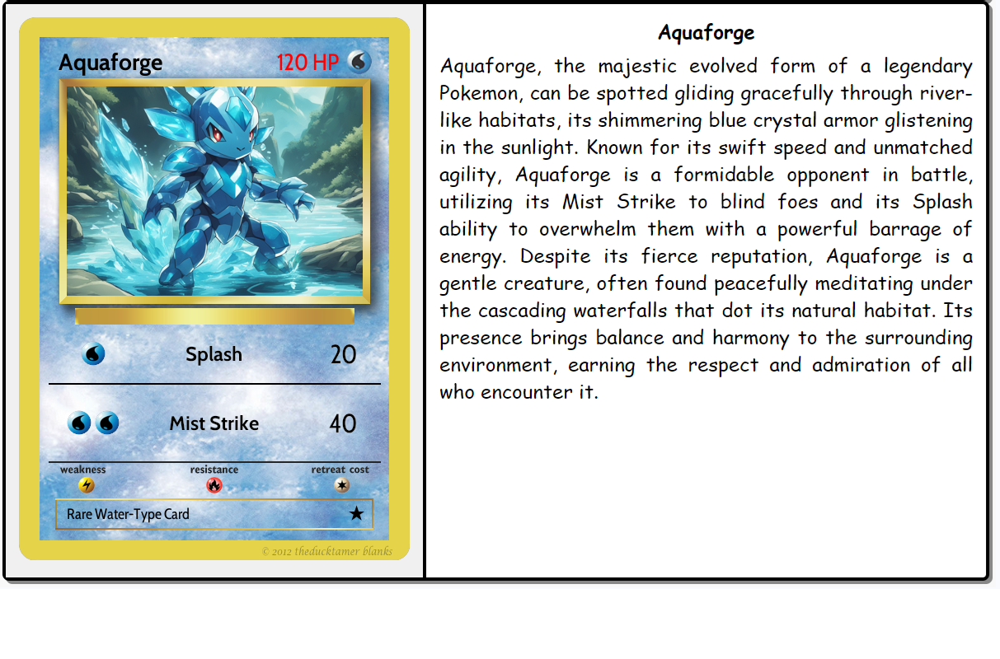

# Sketchemon
1. Draw any sketch in the provided box. Input the number of evolutions you want to generate.

2. Click "Generate Fakemon" and it will generate fake pokemon cards with AI generated abilities resembling your sketch.

